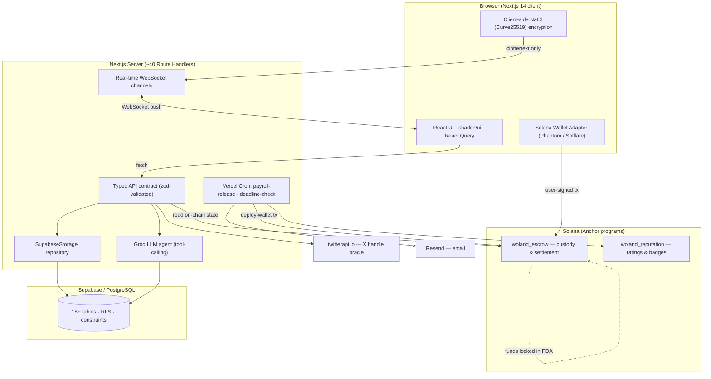
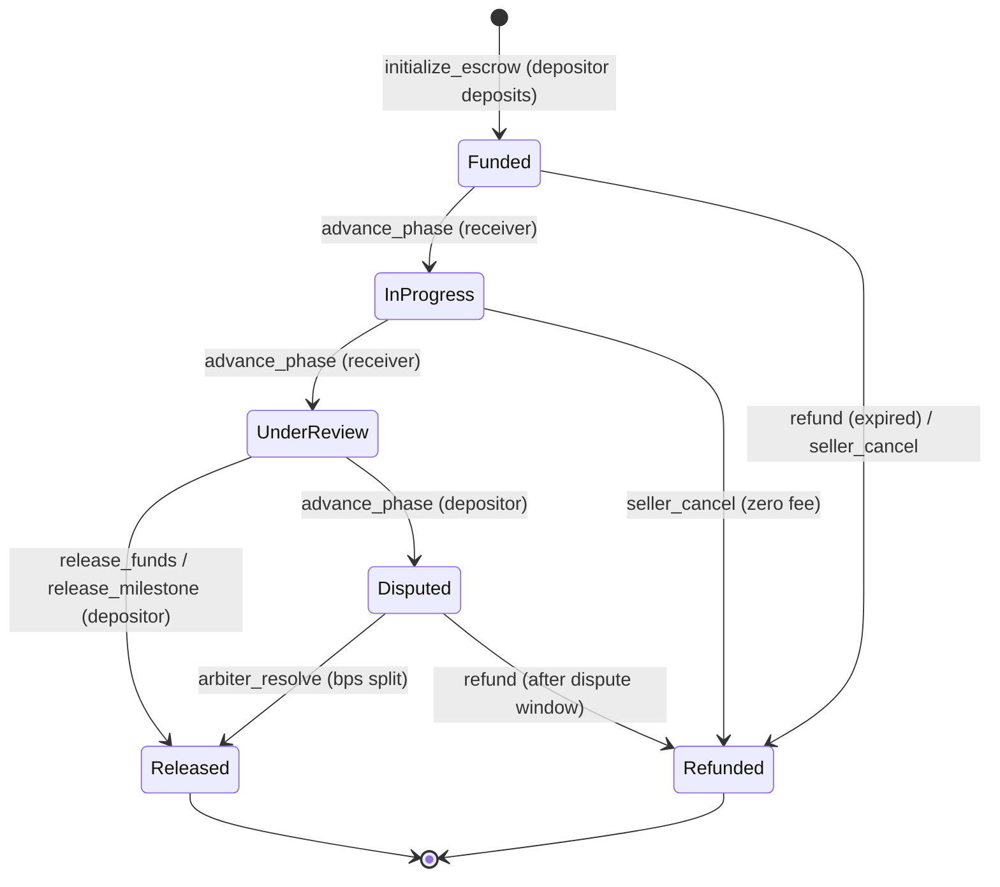

# Wolo — On-Chain Social Marketplace

**A full-stack, fully trustless marketplace for X (Twitter) content services, settled by Solana escrow and on-chain reputation.**

🌐 **Live:** [woloapp.xyz](https://woloapp.xyz/) · 🐦 [@wolo_xyz](https://x.com/wolo_xyz)


Wolo connects brands and individuals who need X content with the creators who produce it. Every order is backed by a **fully trustless, native SOL escrow on Solana** — funds are locked by an on-chain program with no platform custody, and are released only by the program's rules (delivery, milestone approval, scheduled payroll, or dispute resolution). Identity is anchored to a **cryptographically verified X handle**, trust is tracked by an **on-chain reputation program**, conversations run over **end-to-end-encrypted real-time chat**, and discovery is driven by an **LLM marketplace assistant**.

This repository is a single engineer's end-to-end build: UI/UX, front-end, typed API layer, relational data model, two Rust/Anchor programs, the security stack, real-time messaging, the serverless automation that drives settlement, and the automated test suite and CI/CD pipeline behind it.

---

## Table of Contents

- [Architecture](#architecture)
- [On-Chain Programs (Rust / Anchor)](#on-chain-programs-rust--anchor)
- [Backend & Data Model](#backend--data-model)
- [Web Application](#web-application)
- [Real-Time Messaging](#real-time-messaging)
- [Identity & Trust](#identity--trust)
- [AI Marketplace Assistant](#ai-marketplace-assistant)
- [Reputation System](#reputation-system)
- [Automation](#automation)
- [Security](#security)
- [Testing & CI/CD](#testing--cicd)
- [Tech Stack](#tech-stack)
- [Project Structure](#project-structure)
- [Project Status](#project-status)
- [License](#license)

---

## Architecture

Wolo is split across three runtimes that settle against one another: the **browser** (where users sign their own transactions and encrypt their own messages), the **Next.js server** (typed API + Postgres + real-time channels + scheduled jobs), and the **Solana programs** (custody + reputation). The platform never takes custody of user funds — it orchestrates, but the on-chain program holds and releases value.



**Request flow for one escrow order:** purchase → `POST /api/orders` (server injects the buyer identity and does an atomic slot reservation) → `POST /api/escrow` (validates depositor/amount, computes payroll periods, writes the escrow row at `awaiting_deposit`) → the buyer signs and sends the `initialize_escrow` instruction in-browser → `POST /api/escrow/[id]/sync` reads the on-chain phase byte and reconciles the database row through a guarded transition map. Order status, milestones, and chat are then pushed to both parties in real time.

---

## On-Chain Programs (Rust / Anchor)

Two Anchor `0.32.1` programs (Rust, Solana devnet), built with `overflow-checks` and fat LTO.

| Program | Program ID (devnet) | Responsibility |
|---|---|---|
| `woland_escrow` | `9yJBgVvpGvvQRWbPNzDAgv9snP8bvoXXS7A8U28nzNd9` | SOL custody, milestones, payroll, disputes, settlement |
| `woland_reputation` | `42PrQGNH4pCqyGwxrLMXnfkDzz5CTCFx71y2HjuHK9Vg` | On-chain reputation accounts, ratings, badges |

### Escrow as a state machine

Funds are SOL lamports held **inside the escrow account itself** — a Program-Derived Address (PDA) derived from `["escrow", depositor, escrow_id]`. The program owns the account, so settlement is performed by guarded lamport arithmetic rather than a separate custodian. Every phase transition is whitelisted; anything outside the table is rejected with `InvalidPhaseTransition`.



**14 instructions** including `initialize_escrow`, `add_milestone`, `submit_milestone`, `release_milestone`, `release_funds`, `release_action_payout` (partial payouts that drive recurring payroll), `refund`, `arbiter_resolve` (proportional `depositor_share_bps` split), and `seller_cancel`. Milestones are a fixed on-account array (up to 10); their amounts are constrained to never exceed the escrowed total. Platform fees are charged in basis points (capped at 10%) using ceiling division, and the vault's **rent-exemption floor is re-checked after every partial release** so the account can't be silently drained and closed.

### Reputation, on-chain

`woland_reputation` maintains a per-user PDA (`["reputation", user]`) tracking orders completed/disputed, lifetime earned/spent, and a rating sum/count. Ratings are stored as one `RatingRecord` per `(rater, escrow_id)` and **badges are encoded as a `u8` bitmask** recomputed on every update from hardcoded thresholds (e.g. order counts, average rating, dispute-free streaks).

---

## Backend & Data Model

- **PostgreSQL via Supabase**, with hand-written, versioned SQL migrations (no ORM) behind a single `SupabaseStorage` repository class.
- **18+ tables** — `users`, `profiles`, `services`, `orders`, `escrows`, `milestones`, `payroll_periods`, `secure_messages`, `channel_keys`, `reputations`, `ratings`, `deal_proposals`, `notifications`, `sessions`, `watchlist`, and more — with extensive foreign keys (`on delete cascade`), `CHECK` constraints enforcing state enums, indexes on every hot column, and **partial-unique** constraints (e.g. one active order per service/buyer, one pending proposal per order).
- **Row-Level Security is enabled on every table.** Public read policies are exposed only where intended (`services`, `reputations`, `ratings`); all other tables are deny-by-default for the anonymous key, and the server reaches data through an isolated service-role client. Authorization is additionally enforced in the route handlers (participant/owner checks).
- **End-to-end-typed API contract** — request method, path, zod input schema, and response type for every endpoint are declared once in `src/shared/` and shared by both client and server.

---

## Web Application

- **Next.js 14 (App Router)**, React 18, **TypeScript in `strict` mode**.
- **TanStack React Query** for data fetching and cache invalidation, with **real-time WebSocket channels** pushing live updates so the UI reflects on-chain and order state without manual refresh.
- **shadcn/ui** on Radix primitives, Tailwind CSS, Framer Motion.
- **Solana Wallet Adapter** (Phantom, Solflare). The TypeScript client builds Anchor instructions **by hand** — SHA-256 instruction discriminators, manual little-endian buffer encoding, and PDA derivation via `findProgramAddressSync` — and decodes on-chain account state by parsing raw account buffers at fixed byte offsets.

---

## Real-Time Messaging

Each order has a private buyer–seller channel with **real-time delivery over WebSockets** — no polling — so messages, typing state, and order/milestone events arrive instantly.

Messaging is **end-to-end encrypted**: each participant holds a NaCl (Curve25519) key pair, per-channel keys are exchanged through the `channel_keys` table, and message bodies are sealed client-side with `nacl.box` before they ever leave the browser. The server and database store **ciphertext only** (with the ephemeral public key and nonce) and relay it over the real-time channel — plaintext is never readable server-side. Recipients decrypt locally. Live order, milestone, and notification updates ride the same real-time transport.

---

## Identity & Trust

- **Sign-in-with-Solana:** the server issues a single-use, time-boxed nonce; the user signs it with their wallet; the server verifies the **Ed25519** signature (`tweetnacl`) and mints an httpOnly, `SameSite=Strict`, secure-in-production session.
- **X handle ownership oracle:** the server derives a deterministic, **HMAC-bound** verification code from `(userId, handle)`; the user tweets it; the server fetches that handle's recent tweets through **twitterapi.io** and confirms the code. The HMAC binding makes the code non-replayable by any other account, and a blue-check lookup auto-flags influencer accounts.

---

## AI Marketplace Assistant

A **Groq LLM tool-calling agent** (`llama-3.3-70b-versatile`) acts as a marketplace concierge. It runs a bounded tool-execution loop over four server-side tools (`search_services`, `get_marketplace_context`, `get_user_profile`, `signal_create_form`); the model only ever sees live marketplace rows the server fetched for it — there is no document RAG or fine-tuning. Service search is backed by a **deterministic relevance-ranking algorithm** (weighted by price ratio, post count, deadline, and content type, with a relaxed fallback), so ranking quality does not depend on the model.

---

## Reputation System

Reputation is dual-ledger:

- **Off-chain (authoritative for the UI):** on every 1–5 rating the server recomputes the target's average and derives badges (`first_deal`, `trusted_seller`, `top_performer`, `highly_rated`) from positive-rating thresholds. Only participants of a **completed** order can rate their counterparty, enforced by a unique `(rater, order)` constraint.
- **On-chain:** completions, disputes, and ratings are also recorded to the `woland_reputation` program for tamper-evident, wallet-bound history.

---

## Automation

Two **Vercel Cron** jobs, both POST-only and gated by a bearer `CRON_SECRET`, sign on-chain transactions with the platform deploy wallet:

- **`payroll-release`** (daily) — activates due payroll periods, and once a period clears its 48-hour dispute window, submits the on-chain partial payout, records reputation, and advances the escrow when fully paid.
- **`deadline-check`** (daily) — finds escrows past their on-chain `expires_at` and issues refunds, with partial-vs-full messaging based on approved milestones.

Notifications are written in-app, pushed over the real-time channel, and optionally delivered by **Resend** email when the recipient has a verified address.

---

## Security

Security is a first-class concern across every layer:

- **Fully trustless escrow** — value lives in a program-owned PDA and is released only by on-chain rules; there is no platform-custody wallet that can seize funds.
- **End-to-end encryption** — chat is sealed client-side with NaCl (Curve25519) `nacl.box`; the server stores and relays ciphertext only and never sees plaintext.
- **Cross-program account integrity** — when the reputation program references an escrow, it does **not** trust the passed account: it checks the owning program ID, validates the Anchor account **discriminator**, re-derives the escrow PDA from seeds, and confirms the on-chain `id` and phase before accepting a rating. This defends against account-substitution / type-confusion attacks.
- **Pervasive checked arithmetic** (`checked_add/sub/mul/div` plus build-level `overflow-checks`), basis-point fee caps, and rent-floor protection in the on-chain code.
- **Authn/Authz** — Ed25519 wallet auth with single-use nonces; strict, httpOnly sessions; server-side injection of identity fields (`buyerId`, `creatorId`, `recipientId` are never trusted from the client).
- **Input validation** — zod schemas on every insert/patch; `ZodError` mapped to `400`.
- **Defense in depth** — deny-by-default RLS for the anon key, per-IP / per-session rate limiting, `CRON_SECRET` and admin-wallet gating, and hardened HTTP headers (`X-Frame-Options: DENY`, `X-Content-Type-Options: nosniff`, HSTS, `Referrer-Policy`). Secrets are read from the environment; client config is limited to `NEXT_PUBLIC_*`.

---

## Testing & CI/CD

- **On-chain:** the Anchor programs are covered by Rust unit tests and a TypeScript integration suite (`anchor test`) exercising deposit, milestone, release, refund, dispute-split, and reputation flows against a local validator.
- **Off-chain:** unit tests for the storage layer, ranking, and crypto helpers, plus **end-to-end** tests driving the full purchase → escrow → settlement journey in a real browser.
- **CI/CD:** every push runs lint, type-check, the test suites, and the Anchor build through **GitHub Actions**; the web app deploys continuously to Vercel.

---

## Tech Stack

| Layer | Technologies |
|---|---|
| **Front-end** | Next.js 14 (App Router), React 18, TypeScript (strict), Tailwind CSS, shadcn/ui + Radix, Framer Motion |
| **Data fetching** | TanStack React Query |
| **Real-time** | WebSocket channels (live chat, order & notification push) |
| **Back-end** | Next.js Route Handlers (~40), typed API contract, zod validation |
| **Database** | Supabase / PostgreSQL, hand-written SQL migrations, Row-Level Security |
| **Blockchain** | Solana, Anchor 0.32.1 (Rust), `@solana/web3.js`, Wallet Adapter |
| **Encryption** | NaCl / Curve25519 (`tweetnacl`) end-to-end chat encryption |
| **AI** | Groq SDK (`llama-3.3-70b-versatile`) tool-calling agent |
| **Identity** | Sign-in-with-Solana (Ed25519), twitterapi.io X-handle oracle |
| **Email** | Resend |
| **Testing** | Anchor/Cargo tests, Vitest, Playwright (E2E) |
| **Infra / CI** | Vercel (hosting + Cron), GitHub Actions, security headers, rate limiting |

---

## Project Structure

```
src/
  app/(app)/        Pages: marketplace, dashboard, orders, services, profile, admin
  app/api/          ~40 route handlers: escrow, orders, services, ratings,
                    auth, chat, agent, cron, admin
  components/       UI: ServiceCard, ChatPanel, MilestonePanel, PayrollTimeline, ...
  hooks/            React Query + real-time subscription hooks
  lib/              Solana clients (hand-built instructions), NaCl crypto, Groq agent
  server/           Storage layer, auth, notifications, rate limiting
  shared/           zod schemas + the end-to-end-typed route contract
programs/
  woland_escrow/    Anchor program — deposit, milestones, payroll, disputes, settlement
  woland_reputation/Anchor program — reputation accounts, ratings, badges
supabase/           Versioned SQL migrations + RLS policies
scripts/            Devnet config / diagnostics
```

---

## Project Status

Wolo is a **working full-stack application deployed on Solana devnet**, presented here as an engineering portfolio project covering the entire stack — front-end, typed API, relational data, two on-chain programs, real-time end-to-end-encrypted messaging, the security model, and the automated test + CI/CD pipeline.

---

## License

Proprietary. All rights reserved. © Ivan Rykovski.
